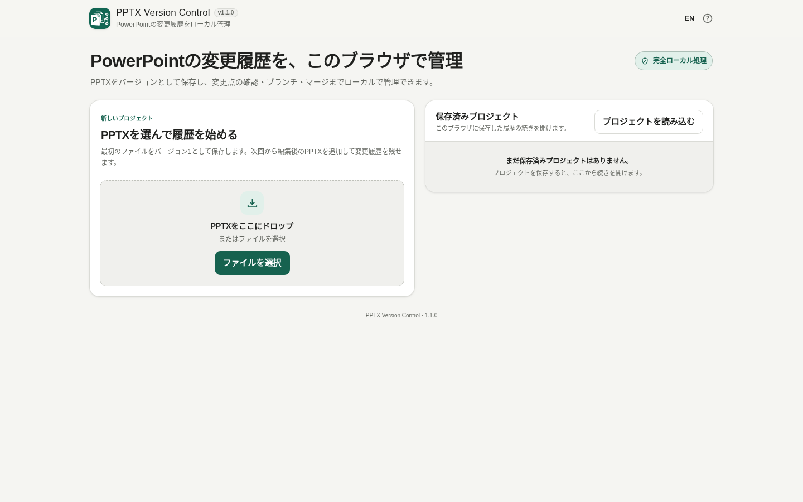

# PPTX Version Control

[](https://github.com/ttomohisa/htmlapps-pptx-version-control/actions/workflows/deploy-pages.yml)
[](LICENSE)
[](https://ttomohisa.github.io/htmlapps-pptx-version-control/)

[English README](README.md)

PowerPoint（PPTX）の変更履歴を、内容の意味と実際の見た目の両方で確認しながら管理するブラウザツールです。選択したPPTXをサーバーへアップロードせず、バージョン保存、Semantic Diff、PPTX Diff風の見た目比較、Branch、3-way Merge、Conflict Resolver、Git向け書き出しまでブラウザ内で扱えます。

## 🚀 デモ

### [GitHub PagesでPPTX Version Controlを開く](https://ttomohisa.github.io/htmlapps-pptx-version-control/)

GitHub Pagesから最初のHTMLを読み込んだ後、PPTX解析、履歴保存、Semantic Diff、Branch / Merge、プロジェクトの入出力、Git向け書き出しは端末内で処理されます。選択したPPTXがアプリからサーバーへ送信されることはありません。

[](https://ttomohisa.github.io/htmlapps-pptx-version-control/)

## 主な機能

- **PowerPointの版をローカル保存** — 最初のPPTXからプロジェクトを作り、編集後のPPTXを同じプロジェクトへ新しいバージョンとして追加できます。
- **意味のある変更を確認** — 生のOOXML差分ではなく、文章、数値、画像、オブジェクト、配置、書式、スライド順、発表者ノートの変更を比較します。
- **実際のスライドを見た目で比較** — 保存済みVersion、Branch HEAD、未保存の編集内容を、横並び・重ね合わせ・分割・点滅で確認できます。
- **Gitのような履歴をブラウザ内に保持** — Project / Commit / Branch / ref / HEADをIndexedDBへ保存し、ObjectはSHA-256ベースで管理します。
- **ファイルを複製せずBranch管理** — Branchの作成、切り替え、名前変更、削除に加え、過去の保存版を起点にBranchを作成できます。
- **分岐した変更をMerge** — BASE / 現在 / 取り込み元の3-way Mergeを行い、安全な場合はスライド、オブジェクト、プロパティ単位で自動統合します。
- **競合を画面上で解決** — 現在側 / 取り込み元側の選択や、対応する文章競合の手動編集を行ってMerge Versionを作成できます。
- **履歴ごと持ち運び** — refs、Commit、必要なObjectを含むプロジェクト全体を `.pptxvc` 1ファイルで書き出し・読み込みできます。
- **通常のGitでもレビューしやすく** — 安定したスライドJSON、正規化した参照関係、SHA-256名のメディアをGit向けZIPとして書き出せます。
- **過去のPPTXをそのまま取り出せる** — HEADを動かさず過去版を開く・保存するほか、古い内容を履歴を消さず新しいバージョンとして復元できます。
- **ファイルを外へ出さない単一HTML** — 実行時通信をCSPで禁止し、日本語 / 英語UIをサーバー処理なしで利用できます。

## すぐに使う

### Webで使う

[デモを開く](https://ttomohisa.github.io/htmlapps-pptx-version-control/)だけで利用できます。インストールやアカウント登録は不要です。

### HTMLをダウンロードして使う

1. このリポジトリの [`dist/index.html`](dist/index.html) をダウンロードします。
2. 最新版のChromeまたはEdgeで開きます。

生成物は単一HTMLです。`DecompressionStream` 対応ブラウザ向けに、より小さい自己展開版 `dist/index.self-extract.html` も同梱しています。

### 自分でビルドする（advance）

1. このリポジトリをダウンロードまたはクローンします。
2. Windowsで `build-standalone.bat` をダブルクリックするか、PowerShellから `./build-standalone.ps1` を実行します。
3. 生成された `dist/index.html` を任意の場所へコピーします。
4. 以降はそのHTML単体をインターネット接続なしで開けます。

Python、Node.js、ローカルWebサーバーは不要です。Windows標準のPowerShellと `tar.exe` を使用します。

## 使い方

1. 最初の `.pptx` をドロップまたは選択します。
2. プロジェクト名とバージョンメモを入力し、最初のバージョンを保存します。
3. PowerPointで資料を通常どおり編集します。
4. **編集後のPPTX** エリアへ編集済みファイルをドロップするか、ファイル選択ボタンから追加します。
5. 検出された変更を確認し、次のバージョンとして保存します。
6. **比較** では任意の保存版やBranch HEADを選び、Semantic Diffと実際のスライド表示を同時に確認できます。
7. 必要に応じて **ブランチ / マージ** を使います。
8. 重要なプロジェクトは `.pptxvc` でも書き出し、ブラウザ内の履歴だけに依存しないようにしてください。

初回確認用として `examples/sample-presentation.pptx` を同梱しています。


### 見た目で比較

**比較** タブではSemantic Diffを変更判定の基準として維持しながら、同じスライドを実際の見た目でも確認できます。左右それぞれでBranchとVersionを選び、選択したスライドを次の4方式で比較できます。

- **横並び** — 2つのVersionを同じスライド比率で表示します。狭い画面では上下に並べます。
- **重ね合わせ** — 同じ位置に重ね、どちらを上側へ表示するか選べます。
- **分割** — スライドの大きさを変えず、Canvas上の境界をドラッグして比較先の表示範囲だけを切り替えます。
- **点滅** — 2つのVersionを交互に表示し、停止 / 再開できます。端末で「視差効果を減らす」が指定されている場合は自動点滅を開始しません。

文章 / 数値 / オブジェクト / 画像 / 配置 / 書式 / 発表者ノートで絞り込みでき、**変更されたスライドのみ**にもできます。見た目上の差分マーカーはSemantic Diffカードと対応しますが、文章変更では変更単語の位置を推測せず、対象テキストボックス全体を示します。

編集後のPPTXをドロップした後は、保存前に **見た目で比較** を押して現在のBranch HEADと未保存ファイルを確認できます。この操作だけでは新しいVersionは作成されません。

### 履歴と復元

過去バージョンを開いても、現在のBranchのHEADは動きません。過去版をPPTXとして保存したり、任意の2バージョンを比較したり、過去の内容を**新しいバージョンとして復元**できます。

古い版から別の編集を続けたい場合は、その保存版を起点に新しいBranchを作成します。

### BranchとMerge

各Branchは独立したHEADを持ちます。別Branchを現在のBranchへ取り込むときは共通のBASEを探し、BASE / 現在 / 取り込み元を比較します。

別スライド、別オブジェクト、または安全に独立して扱えるプロパティの変更は自動統合できます。安全にPPTXへ反映できない競合は無理に混ぜず、Conflict Resolverへ残します。

### プロジェクトのバックアップ

履歴はブラウザのIndexedDBに保存します。ブラウザデータの削除などで失われる可能性があるため、重要なプロジェクトは `.pptxvc` として書き出してください。

`.pptxvc` にはプロジェクト情報、refs、Commit、必要なContent-addressed Objectが含まれます。読み込み時には構造を検証し、Objectの宣言サイズとSHA-256を確認してからローカル保存します。

## Git向け書き出し

プロジェクト管理の **「Git向けに書き出す」**、または保存済みバージョンの詳細からGit向けZIPを書き出せます。生成ZIPには次のような正規化データが含まれます。

```text
manifest.json
presentation.json
slides/
  <安定したスライドID>.json
media/
  <sha256>.<拡張子>
metadata/
  relationships.json
README.md
```

`slides/` はスライド番号ではなく安定IDをファイル名に使うため、途中へスライドを追加・並べ替えしても後続ファイルが一斉にリネームされにくい構成です。`media/` はSHA-256で重複を除き、PowerPoint内部で変動しやすい `rId` は実際の参照先へ正規化します。

Git向け書き出しは**通常のGitで差分レビューしやすくするための形式**です。完全なプロジェクトバックアップではなく、`.git` の生成・clone・push・同期も行いません。PPTX Version Controlの履歴と元PPTXをまとめて持ち運ぶ場合は `.pptxvc` を使用してください。

## GitHub Pagesで公開する

このリポジトリには、単一HTMLをビルドして `dist/` をGitHub Pagesへ公開するワークフローが含まれています。

1. リポジトリ名を `htmlapps-pptx-version-control` としてGitHubへプッシュします。
2. **Settings → Pages → Build and deployment → Source** で **GitHub Actions** を選択します。
3. `main` ブランチへプッシュするか、Actions画面から **Deploy standalone app to GitHub Pages** を手動実行します。
4. 成功後、`https://ttomohisa.github.io/htmlapps-pptx-version-control/` で公開されます。

`main` へのPushでは、リポジトリ検証、単一HTMLの再生成、配布物の検査を行ったうえで、GitHub Pagesが有効な場合に生成済み `dist/` を公開します。


> v1.1.2では、保存済みVersion同士・Branch同士・HEADと未保存PPTXの見た目比較を正式に公開しました。比較操作は読み取り専用で、明示的にVersionを保存するまで履歴やHEADを変更しません。

## 開発とビルド

```text
.
├─ src/index.template.html       # アプリ本体テンプレート
├─ app.config.json               # アプリ情報とビルド設定
├─ assets/favicon.svg            # favicon / 左上ブランドアイコン
├─ dependencies.json             # 内包依存の宣言
├─ dependencies.lock.json        # 確認済み依存のlock
├─ build-standalone.bat          # Windows用ビルド入口
├─ build-standalone.ps1          # 単一HTML生成
├─ examples/
│  └─ sample-presentation.pptx   # 初回確認用サンプル
├─ scripts/                      # リポジトリ / ビルド検証
└─ dist/
   ├─ index.html                 # 通常の単一HTML版
   └─ index.self-extract.html    # 圧縮した自己展開版
```

ビルド:

```powershell
.\build-standalone.ps1
```

リポジトリ全体の確認:

```powershell
.\scripts\check-repository.ps1
```

通常の単一HTMLを確認:

```powershell
.\scripts\verify-standalone.ps1
```

ビルド時には `assets/favicon.svg` をfaviconとアプリ左上のブランドアイコンへ同じSVGとして埋め込み、未置換プレースホルダー、単一HTMLの通信制約、生成物の整合性を検査し、manifestと自己展開版も生成します。

## プライバシーと通信防止

PPTXファイルとプロジェクト履歴はブラウザ内で処理します。プレゼン内容をBrowser Kittyや外部サーバーへアップロードしません。

生成HTMLには `connect-src 'none'` を含むContent Security Policyが設定され、実行時の `fetch`、XHR、WebSocketなどの外向き通信をページ側で禁止します。GitHub Pages版では最初のHTMLを取得する通信は発生しますが、読み込んだPPTXの内容はアプリから送信されません。完全にネットワークを切って使う場合は、生成済みの `dist/index.html` をローカルで開いてください。

プロジェクト履歴は端末内のIndexedDBへ保存します。ブラウザやサイトデータを削除すると履歴が消える可能性があるため、持ち運び・バックアップ用に `.pptxvc` 書き出しを用意しています。

## 制限事項

- 正式対応形式は `.pptx` です。`.pptm` / `.potx` / `.ppsx` はまだ正式対象ではありません。
- SmartArt、OLE、未対応のOOXML拡張などは可能な範囲で元パッケージを保持しますが、細かなSemantic Diffを表示できない場合があります。
- relationshipや外部リソースが複雑に絡む競合など、安全にプロパティ単位で統合できないケースは自動MergeせずConflictとして残します。
- 過去版を開く操作は読み取り専用です。そこから編集を続ける場合は、そのバージョンからBranchを作成します。
- Git向け書き出しは通常のGitリポジトリへ置くための正規化ファイルを生成します。`.git` の作成、clone、push、同期は行いません。
- ローカル履歴はIndexedDBに依存するため、ブラウザ / サイトデータの削除で失われる可能性があります。
- 大きなPPTX、メディアを多く含む資料、長い履歴では端末のメモリやローカル保存領域を多く使用します。
- 一般的なDeflate圧縮PPTXの解析には `DecompressionStream('deflate-raw')` が必要です。主対象ブラウザは最新版のChrome / Edgeです。

## 依存ライブラリ

| ライブラリ | バージョン | ライセンス | 用途 |
| --- | ---: | --- | --- |
| @aiden0z/pptx-renderer | 1.2.4 | Apache-2.0 | 「見た目で比較」の高精細スライド描画 |

PPTXパッケージ解析、Semantic Model、ローカル履歴、Branch / Merge、Git向け書き出しは引き続きブラウザAPIとアプリ内実装で構成しています。レンダラーはビルド時に単一HTMLへ内包され、実行時の外部通信依存はありません。

詳細は [THIRD_PARTY_NOTICES.md](THIRD_PARTY_NOTICES.md) を確認してください。

## コントリビューション

バグ報告や機能提案はIssueからお願いします。開発への参加方法は [CONTRIBUTING.md](CONTRIBUTING.md) を確認してください。

## ライセンス

Copyright © 2026 ttomohisa

このプロジェクトは [MIT License](LICENSE) で公開されています。
