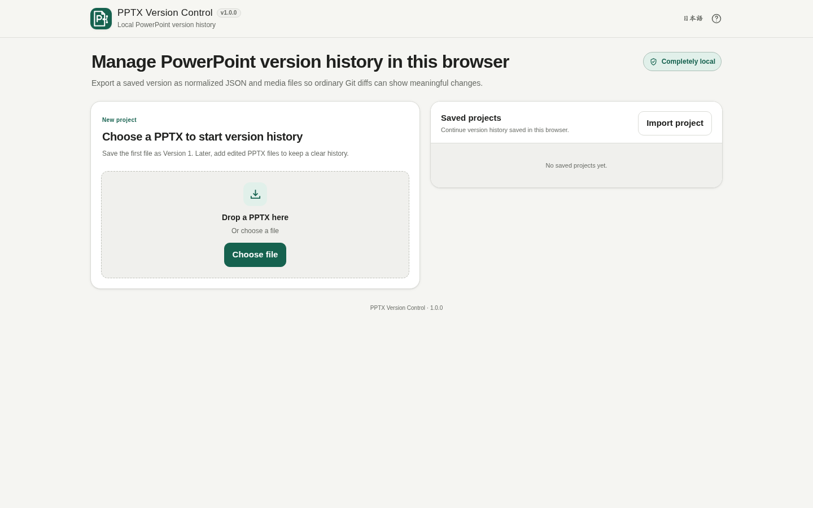

# PPTX Version Control

[](https://github.com/ttomohisa/htmlapps-pptx-version-control/actions/workflows/deploy-pages.yml)
[](LICENSE)
[](https://ttomohisa.github.io/htmlapps-pptx-version-control/)

[日本語版 README](README.ja.md)

A browser-only PowerPoint version-control tool for `.pptx` files. It stores project history locally, compares meaningful presentation changes, and provides branch, merge, conflict-resolution, and Git-friendly export workflows without uploading selected presentations to a server.

## 🚀 Live demo

### [Open PPTX Version Control on GitHub Pages](https://ttomohisa.github.io/htmlapps-pptx-version-control/)

GitHub Pages delivers the initial HTML. After it loads, PPTX parsing, version storage, semantic diff, branch and merge processing, project import/export, and Git-friendly export are processed locally on your device. The PPTX files you select are not uploaded by the app.

[](https://ttomohisa.github.io/htmlapps-pptx-version-control/)

## Features

- **Save PowerPoint versions locally** — Create a project from a PPTX, then drop each edited PPTX into the same project as a new version.
- **Review meaningful changes** — Compare text, numbers, images, objects, layout, formatting, slide order, and speaker notes instead of raw OOXML noise.
- **Keep Git-like history in the browser** — Project, commit, branch, ref, and HEAD data are stored in IndexedDB with SHA-256 content-addressed objects.
- **Branch without duplicating presentations manually** — Create, switch, rename, and delete branches, including branches created from older saved versions.
- **Merge divergent work** — Use 3-way merge with BASE / current / incoming versions and automatic slide-, object-, and property-level merging when safe.
- **Resolve conflicts in the UI** — Choose the current or incoming change, or manually edit supported text conflicts before creating the merge version.
- **Take your history with you** — Export and import a complete project as one `.pptxvc` file, including refs, commits, and required objects.
- **Review normalized data with ordinary Git** — Export stable per-slide JSON, resolved relationships, and SHA-256-named media as a Git-friendly ZIP.
- **Restore real PPTX files** — Open or export historical versions without moving HEAD, and restore older content as a new version while preserving history.
- **Private, single-HTML operation** — Runtime network connections are blocked by CSP, with Japanese/English UI and no server-side file processing.

## Quick start

### Use the web demo

Just [open the demo](https://ttomohisa.github.io/htmlapps-pptx-version-control/). No installation or account is required.

### Use the downloaded HTML

1. Download [`dist/index.html`](dist/index.html) from this repository.
2. Open it in a current Chrome or Edge browser.

The generated file is a standalone HTML document. `dist/index.self-extract.html` is also included as a smaller self-extracting variant for browsers that support `DecompressionStream`.

### Build it yourself (advanced)

1. Download or clone this repository.
2. Double-click `build-standalone.bat` on Windows, or run `./build-standalone.ps1` from PowerShell.
3. Copy the generated `dist/index.html` wherever you need it.
4. Open that single file later without an internet connection.

Python, Node.js, and a local web server are not required. The builder uses Windows PowerShell and the built-in `tar.exe`.

## Usage

1. Drop or choose the first `.pptx` file.
2. Enter a project name and version note, then save the first version.
3. Edit the presentation normally in PowerPoint.
4. Drop the edited PPTX into the **edited PPTX** area, or choose it with the file button.
5. Review the detected changes and save the next version.
6. Use **History**, **Diff**, **Branches**, and **Merge** when you need to inspect or combine work.
7. Export important projects as `.pptxvc` files so the browser database is not your only copy.

A small first-run sample is included at `examples/sample-presentation.pptx`.

### History and restore

Opening a historical version is read-only and does not move the current branch HEAD. You can export that version as a PPTX, compare it with another saved version, or restore its content as a new version while keeping the existing history.

To continue editing from an older point without changing the current branch, create a new branch from that saved version.

### Branches and merge

Each branch has its own HEAD. When merging another branch into the current branch, the app finds a common BASE and compares BASE / current / incoming states.

Changes on different slides, different objects, or different supported properties can be merged automatically when the app can safely materialize the result. Conflicting edits are sent to the Conflict Resolver instead of being forced into the PPTX.

### Project backup

Project history is stored in IndexedDB. Browser data can be cleared, so important projects should also be exported as `.pptxvc` files.

A `.pptxvc` file contains project metadata, refs, commits, and the required content-addressed objects. Imported projects are structurally validated and object sizes and SHA-256 hashes are checked before storage.

## Git-friendly export

Use **Export for Git** from project management, or export a saved version from Version Details. The generated ZIP contains normalized files such as:

```text
manifest.json
presentation.json
slides/
  <stable-slide-id>.json
media/
  <sha256>.<ext>
metadata/
  relationships.json
README.md
```

Slide files use stable IDs instead of slide numbers, so inserting or reordering slides does not rename every following file. Media files are deduplicated by SHA-256, and relationship targets are resolved without volatile `rId` values.

Git-friendly export is for ordinary Git diff/review. It is not a complete project backup and does not create or push a `.git` repository. Use `.pptxvc` when you need the full PPTX Version Control history and original PPTX package data.

## Publish with GitHub Pages

The repository includes a workflow that builds the standalone HTML and deploys `dist/` to GitHub Pages.

1. Push the repository to GitHub as `htmlapps-pptx-version-control`.
2. Open **Settings → Pages → Build and deployment → Source** and select **GitHub Actions**.
3. Push to `main`, or manually run **Deploy standalone app to GitHub Pages** from the Actions tab.
4. After a successful deployment, the demo is available at `https://ttomohisa.github.io/htmlapps-pptx-version-control/`.

Each push to `main` validates the repository, rebuilds the standalone HTML, checks the single-file output, and deploys the generated `dist/` directory when GitHub Pages is enabled.

## Development and build layout

```text
.
├─ src/index.template.html       # Application template
├─ app.config.json               # App metadata and build settings
├─ assets/favicon.svg            # Favicon and upper-left app icon
├─ dependencies.json             # Bundled dependency declarations
├─ dependencies.lock.json        # Reviewed dependency lock
├─ build-standalone.bat          # Windows build entry point
├─ build-standalone.ps1          # Standalone HTML builder
├─ examples/
│  └─ sample-presentation.pptx   # Small first-run sample
├─ scripts/                      # Repository/build verification
└─ dist/
   ├─ index.html                 # Readable standalone app
   └─ index.self-extract.html    # Compressed self-extracting variant
```

Build the app:

```powershell
.\build-standalone.ps1
```

Run the repository checks:

```powershell
.\scripts\check-repository.ps1
```

Verify the readable standalone HTML directly:

```powershell
.\scripts\verify-standalone.ps1
```

The build process embeds the canonical SVG icon into both the favicon and app header, rejects unresolved placeholders, verifies standalone-network restrictions, generates the dependency/build manifests, and creates the optional self-extracting HTML.

## Privacy and runtime network protection

PPTX files and project history are processed in the browser. The app does not upload presentation contents to Browser Kitty or another server.

The generated HTML includes a Content Security Policy containing `connect-src 'none'`, so runtime `fetch`, XHR, WebSocket, and similar outbound connections are blocked by the page policy. GitHub Pages still requires the initial HTML request; for use with the network completely disconnected, open the generated `dist/index.html` locally.

Local project history is stored in IndexedDB on the device. Deleting browser site data can remove that history, which is why `.pptxvc` export is provided for portable backups.

## Limitations

- The stable input format is `.pptx`. `.pptm`, `.potx`, and `.ppsx` are not release targets yet.
- SmartArt, OLE objects, and unsupported OOXML extensions are preserved through the original package where possible, but may not receive detailed Semantic Diff.
- Some package-level or relationship-heavy conflicts cannot be safely combined property by property. The app keeps those as conflicts rather than forcing an unsafe merge.
- Historical versions open read-only. Create a branch from an older version when you want to continue editing from that point.
- Git-friendly export creates normalized files for a normal Git repository. It does not create, clone, push, or sync a Git repository.
- Local history depends on IndexedDB and can be removed when browser/site data is cleared.
- Large presentations, many embedded media files, or long histories can consume substantial browser memory and local storage.
- Normal Deflate-compressed PPTX parsing requires browser support for `DecompressionStream('deflate-raw')`; current Chrome and Edge are the primary targets.

## Dependencies

The application currently bundles no third-party runtime libraries. PPTX package parsing, semantic modeling, ZIP handling, version-control storage, and export logic are implemented in the app with browser APIs.

See [THIRD_PARTY_NOTICES.md](THIRD_PARTY_NOTICES.md) for repository policy around future dependencies.

## Contributing

Bug reports and feature proposals are welcome through GitHub Issues. See [CONTRIBUTING.md](CONTRIBUTING.md) for development guidance.

## License

Copyright © 2026 ttomohisa

Licensed under the [MIT License](LICENSE).
